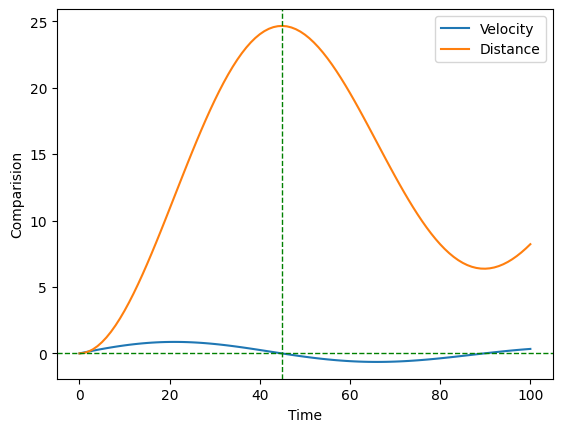

# ComputationPhysics


#Integration using the trapezoid method

```python
import numpy as np
import matplotlib.pyplot as plt
```


```python
def trapezoid(f, N, a, b):
    h = (b - a)/N
    result = 0
    for k in range(1, N+1):
        result += (f(a+(k-1)*h) + f(a+k*h))
    result = result * (0.5*h)
    return result
```


```python
def f(x):
    #Correct integral from 0 to 2 is 4.4
    return x**4-2*x+1
```


```python
a = 0
b = 2

actualIntegral = 4.4

N = 10
calculated1 = trapezoid(f, N, a, b)

N = 100
calculated2 = trapezoid(f, N, a, b)

N = 1000
calculated3 = trapezoid(f, N, a, b)

print("Integrating x**4-2*x+1 from 0 to 2")
print(f"Actual value of integral: {actualIntegral}")
print()
print("N = 10")
print(f"Calculated Value: {calculated1} with % error {abs((actualIntegral - calculated1)/actualIntegral * 100)}")

print()
print("N = 100")
print(f"Calculated Value: {calculated2} with % error {abs((actualIntegral - calculated2)/actualIntegral * 100)}")

print()
print("N = 1000")
print(f"Calculated Value: {calculated3} with % error {abs((actualIntegral - calculated3)/actualIntegral * 100)}")
```

    Integrating x**4-2*x+1 from 0 to 2
    Actual value of integral: 4.4
    
    N = 10
    Calculated Value: 4.50656 with % error 2.4218181818181814
    
    N = 100
    Calculated Value: 4.401066656 with % error 0.024242181818179272
    
    N = 1000
    Calculated Value: 4.400010666665602 with % error 0.0002424242182148943


```python
#This examples uses data points rather than functions to evaluate integral
#Exercise 5.1
time = []
distance = [0]
velocity = []

with open("velocities.txt") as f:
    for line in f:
        row = line.split()
        time.append(float(row[0]))
        velocity.append(float(row[1]))
    dis = 0
    h = 1
    assert len(time) == len(velocity)
    for i in range(1, len(velocity)):
        dis += (velocity[i-1] + velocity[i])
        distance.append(dis*0.5*h)


```


```python
plt.plot(time, velocity, label = "Velocity")
plt.plot(time, distance, label = "Distance")
plt.axhline(y = 0, color = 'green', linestyle = 'dashed', linewidth = 1)
plt.axvline(x = 45, color = 'green', linestyle = 'dashed', linewidth = 1)
plt.xlabel("Time")
plt.ylabel("Comparision")
plt.legend()
plt.show()
```


    

    
